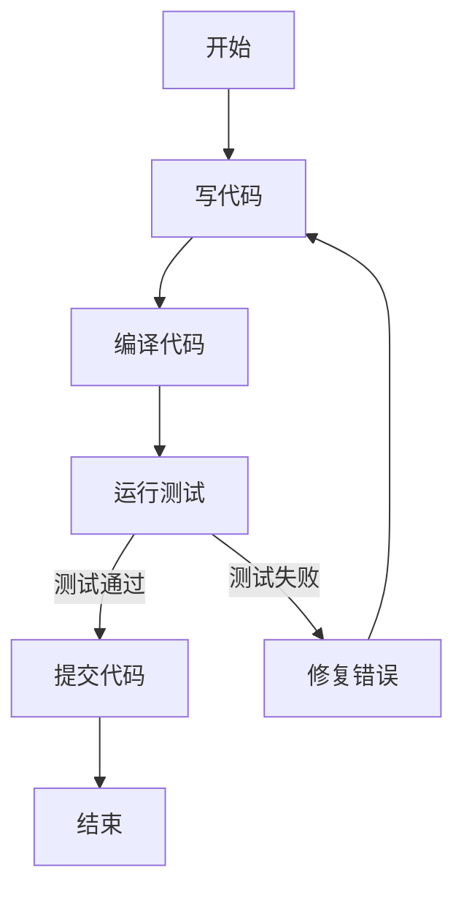
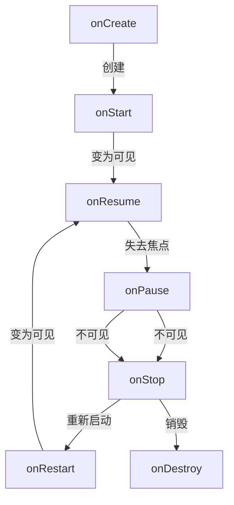

# 
## 前言
markdown是一种轻量的标记语言，标记语言就是用特殊的字符（标记）来指定文档结构和格式的语言，它的原理就是将用更简单的标记书写然后转换成HTML，markdown是如此轻量，语法标签很少，十分钟上手足矣。Markdown替代不了Word，Word也替代不了Markdown，我们要做的是在不同的场景选择称手的工具。
## 1 基本语法
### 1.1 标题
**（1）语法** 
语法：# 标题文字

要写文章，首先要有个标题，Markdown中用"#"来标识标题，# 的数量代表了标题的级别，一共有1到6级标题，#号越多字号越小。

**（2）书写规范** 
一般情况下不建议使用超过四层标题。具体什么标题用多大的字号参考：
>一级标题：文章的标题
二级标题：文章主要部分的大标题
三级标题：二级标题下面一级的小标题
四级标题：三级标题下面某一方面的小标题

**（3）标题序号**  
如果需要为标题加上序号，可以参考论文中的标题序号规范：
>第一层：一、汉字数字加顿号
 第二层：（一）　括号中包含汉字数字
 第三层：1．阿拉伯数字加下脚点
 第四层：（1）括号中包含阿拉伯数字
 >
>第五层：① 带圈的阿拉伯数字,或者“1）”
 第六层：A. 第六层为大写英文字母，或者“（A）”
 第七层：a. 第七层为小写英文字母，或者“（a)”
 
此外还可用阿拉伯数字连续编码，多用于理科类论文的各层次标题。不同层次的数字之间用半角圆点（.）分隔开，末位数字后面不加点号。如“1”，“1.2”，“1.2.1”等；各层次的标题序号均左顶格排写，最后一个序号之后空一个字距（一个全角空格）接排标题，：

```markdown
# 软件手册文档结构
## 1 简介
### 1.1 入门篇
#### 1.1.1 环境准备
#### 1.1.2 安装
## 2 进阶篇
```

### 1.2 段落
语法：顶格书写，不需要缩进，段与段之间用空行隔开

在传统的文本编辑中，有些人习惯使用空格或制表符来手动缩进段落，以使文本看起来更整齐，在 Markdown 中采用的是齐头式，段落之间是通过空行来进行分隔的，Markdown 的设计理念是简洁、易读，因此一般在文章的开头不需要额外的缩进。

### 1.3 换行
语法：在一行的末尾空两个空格或者使用`<br>`

### 1.4 字体效果
语法：使用星号（`*`）括起来，中间没有空格，不同数量的型号有不同的效果
* 斜体：一个星号，例如`*斜体效果*`：*斜体效果*
* 粗体：两个星号，例如`**加粗效果**`：**加粗效果**
* 斜体并粗体：三个星号：例如`***加粗并倾斜***`：***加粗并倾斜***

### 1.5 引用
语法：在需要引用的文字前加`>`，例如：
```
>我家门前两棵树，一棵是枣树，另一棵也是枣树
```
效果是：
>我家门前两棵树，一棵是枣树，另一棵也是枣树

### 1.6 列表
**（1）有序列表**

语法：列表项前添加数字并紧跟一个英文句点


**（2）无序列表**  
语法：列表项前添加星号 (*) 并间隔一个空格

破折号 (-)、星号 (*) 或加号 (+)都可以用来表示无序列表，效果相同，为了避免方便记忆，多种表示方式都只介绍一种，下文同。

### 1.7 代码
**（1）词语**
语法:反引号 (\`)括起来
例如将 `http://localhost/`用(\`)括起来就能作为代码，而不是超链接。

**（2）代码块**
语法：用三个反引号 (\`\`\`)括起来，每个（\`\`\`）单独一行
* 语法高亮：在第一个（```）指定一种语言
```python
def hello_world():
    print("Hello, World!")
```

### 1.8 分割线
语法：三个或以上的星号(*)，单独一行

### 1.9 链接
**（1）普通链接**
语法：`[链接描述](url,"鼠标悬停文字（可选）")`，
例如
`[google](https://www.google.com/，"谷歌官网")`，效果：[google](https://www.google.com/，"谷歌官网")

**（2）网址和邮箱地址**
语法：可以直接用尖括号括起来

**（3）引用类型链接**
引用类型链接是一种更具可读性和可维护性的方式，可以将链接的定义与文本内容分离，使文档更清晰。
语法：`[链接描述][链接lable]`，然后在文末定义链接`[链接lable]:url`，例如：

```markdown
这是[Google的官方网站][1]。

<!--文末-->
[openai]: https://www.google.com/
```
效果:
这是[Google的官方网站] [1]
[1]: https://www.openai.com

### 1.10 插入图片
语法:``，相比链接语法多了一个叹号（!）

## 2 扩展语法（选修）
### 2.1 表格
语法：来自Markdown文档的描述
>要添加表，请使用三个或多个连字符（---）创建每列的标题，并使用竖线（|）分隔每列。您可以选择在表的任一端添加竖线
```
| 列名1      | 列名2 |
| ----------- | ----------- |
| Header      | Title       |
| Paragraph   | Text        |
```
| 表头      | 描述 |
| ----------- | ----------- |
| Header      | Title       |
| Paragraph   | Text        |
* 对齐
>您可以通过在标题行中的连字符的左侧，右侧或两侧添加冒号（:），将列中的文本对齐到左侧，右侧或中心

### 2.2 mermaid扩展
Mermaid是一个用文本生成UML图表的开源的JavaScript库，可以用来绘制类图、饼图、流程图、时序图等等。通常Markdown编辑器都支持持mermaid扩展，于是你就可以像写Markdown一样绘制UML图表。虽然有点丑，胜在简单，复杂的时序图还是建议用专门的图表工具画。

#### 2.2.1 时序图

时序图是用来描述一个系统之中对象之间交互和协作过程的图表。时序图用角色和对象表示系统中有哪些参与者，用箭头表示事件（消息/动作）传递。纵向往下表示时间流逝，横向表示传递方向，往右是发起事件，往左是响应事件。

我们对照UML时序图的基本元素来看Mermaid的时序图是如何实现的：
| 时序图元素 | 表示方式| Mermaid实现方式 |
| --- | --- |--- |
| 角色 |火柴人，可省略|无  |
| 对象 |矩形|使用`participant` 简短别名 `as` 对象全名创建  |
| 生命线 | 角色矩形下方的竖直虚线|Mermaid创建对象自带生命线 |
| 激活框 | 生命线上的一个窄矩形，表示某一阶段|开始语句：`activate` 对象A<br>结束语句：`deactivate` 对象A
| 发送消息 | **实线**箭头,指向接收者。如果严格区分区分，<br>则实心箭头表示同步消息（阻塞，等待响应），<br>大于号箭头表示异步，非阻塞。|`->>`，例如Ezekiel `->>` Tony：What's your name?| 
| 返回消息 | **虚线**小于号箭头，指向发送者|`-->>`，例如Tony `->>` Ezekiel: tony！|
| 自关联消息 | 指向对象自身的箭头<br>即自我调用|对象A `->>` 对象A |
| 组合片段-循环 | 表示该片段重复执行，类似于for语句|Iterator`->>`Array: 初始化遍历<br>`loop`  遍历数组<br>&emsp;&emsp; Array`-->>`Iterator: 返回下一个元素<br>Iterator`-->>`Iterator: 读取元素的值<br>`end`<br>|
| 组合片段-分支 | 选项（Opt）：可能发生，相当于单个if<br>抉择（Alt）:发生其中一个，相当于多个if|  Client`->>`Server: 发起 HTTP 请求<br>`alt` 请求成功 (200 OK)<br>&emsp;&emsp;Server`-->>`Client: 返回 200 OK<br>`else` 请求失败 (404 Not Found) <br>&emsp;&emsp;Server`-->>`Client: 返回 404 Not Found<br>`end`，注`else`是可选的，省略则变成`选项`|

Mermaid的时序图中还有各种箭头，以区别不同的消息类型，~~不过简单使用的话我觉得没必要分这么细~~

```mermaid
sequenceDiagram
    title:演示mermaid时序图中的各种箭头
    participant E as Ezekiel
    participant T as Tony
    E->T: What's your name?
    T-->E: WHAT?!
    E->>T:What is your name?!!
    T-->>E:Tony!
    E-xT:Fuck you Tony!
    T--xE:What's your name?
    E-)T:Ezekiel!!
    T--)E:Fuck you Ezekiel!
```

Markdown中绘制时序图基本步骤：
1. `sequenceDiagram` ：定义一个时序图。
2. 定义时序图中的出现的参与者，`participant 角色别名 as 角色全名`。
3. 依次绘制消息流。

以画一个客户端通过浏览器访问Google首页的基本过程的时序图为例子：
```mermaid
sequenceDiagram
    title:客户端通过浏览器访问Google首页的基本过程
    participant c as 浏览器
    participant r as 路由器
    participant s as 谷歌服务器
    participant dns as DNS服务器
    c->>r: 1.请求DNS查询：<br>google的ip地址
    r->>dns: 2.查询google的ip地址
    dns-->>r:3.返回google的ip
    r-->>c:告知google的ip
    c->>r:4.发起连接：google的ip地址
    r->>s:连接
    s-->>r:告知连接成功
    r-->>c:5.告知连接成功
```

```sequence
  Title:时序图示例
  participant 客户端
  客户端->服务端: 我想找你拿下数据 SYN
  服务端-->客户端: 我收到你的请求啦 ACK+SYN
  客户端->>服务端: 我收到你的确认啦，我们开始通信吧 ACK
  客户端->>客户端: 自我调用
  Note right of 服务端: 我是一个服务端
  Note left of 客户端: 我是一个客户端
  Note over 服务端,客户端: TCP 三次握手
  participant 观察者
```

### 2.3 流程图

```flow
st=>start: 开始框
op=>operation: 处理框
cond=>condition: 判断框(是或否?)
sub1=>subroutine: 子流程
io=>inputoutput: 输入输出框
e=>end: 结束框
st->op->cond
cond(yes)->io->e
cond(no)->sub1(right)->op
```








## 参考资料
[1] [Markdown 官方教程](https://markdown.com.cn/)


